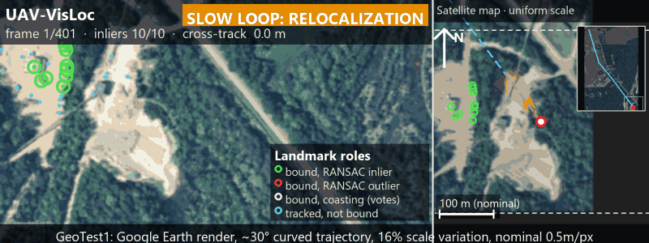
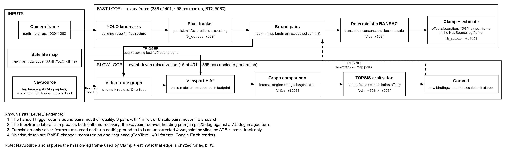

# UAV-VisLoc

Pure-visual UAV localization: YOLO detects landmarks (buildings, trees, infrastructure) in each
video frame and the pipeline matches them against landmarks pre-extracted from a satellite map.
This README covers how to reproduce the reference run and what the measurement tooling records.



*GeoTest1: Google Earth render, ~30° curved trajectory, 16% scale variation, nominal 0.5m/px.*
Left: camera with landmark roles and the active loop. Right: satellite map at one uniform scale, following the
estimate, with the GT polyline (dashed), trajectory (green) and relocalization commits (magenta).

### Limits of this demo, read before the animation

- **Synthetic imagery.** The sequence is a Google Earth render (the watermark is visible), not real flight video,
  and it is the only sequence evaluated. It has one gradual ~30° curve, not a multi-turn flight.
- **No IMU or odometry.** The environment is a synthetic 2D map render, so there are no inertial sensors or
  wheel/flow odometry. Position comes only from visual landmark localization. Two non-visual inputs shape it: the
  mission-leg heading replayed from the flight-controller log (`nav.source: "telemetry"`), which orients the
  kinematic clamp, and a short coast. When visual consensus is lost, the estimate is extrapolated at constant velocity
  from its own recent trajectory for up to 15 frames (`coasting.max_frames`). After that it is declared lost and
  relocalization starts. Nothing integrates measured physical motion.
- **North-up nadir camera assumed.** The solver estimates translation only, at a scale locked once at boot.
  Camera roll, pitch or yaw break this assumption, and this sequence does not test it.
- **Uncorrected ground truth.** Errors are cross-track only, against a 4-waypoint GPS polyline whose projection
  disagrees with the map image by roughly a similarity transform (s 0.766, −6.6°). Metres are map px × a nominal,
  unverified 0.5 m/px. See [Experimental Evaluation](#experimental-evaluation).
- **GIF rendering.** The GIF shows every 4th frame at 5 fps (13.4 s of video over ~20 s, 0.67× real time), with background imagery softened to fit 10 MB.
  `scripts/render_demo.py` also writes a real-time 1920×720 diagnostic MP4 that adds the SIFT image-matching
  reference trajectory (not committed: ~70 MB).

### How it works: fast loop and slow loop



- **Fast loop (every frame, 386 of 401 frames on its own).** YOLO detects landmarks, and a pixel tracker keeps
  persistent IDs. Tracks bound to map landmarks, including coasting tracks on their predicted positions, vote in a
  deterministic translation RANSAC at the locked scale. An asymmetric kinematic clamp in the mission-leg frame bounds
  per-frame motion. About 58 ms/frame median on an RTX 5060.
- **Slow loop (event-driven, 15 of 401 frames).** Fires at boot, when tracking is lost, or when bound pairs drop to
  ≤2. It builds a landmark route graph from the frame and searches class-matched map routes with A* inside the
  predicted viewport. Candidates are compared by angles and scale-invariant edge-length ratios and ranked by TOPSIS.
  The winner commits new bindings. Candidate generation takes ~355 ms median when it runs.
- Badges on the diagram are Level 2 ablation deltas. Mermaid source and details:
  [docs/architecture.md](docs/architecture.md).

Render the demo assets:
```bash
python run.py --config configs/demo.yaml   # with output.track_log: out/demo/track_log.jsonl set
python scripts/render_demo.py --config configs/demo.yaml --frame-log out/frame_log.csv --profile out/profile.csv --track-log out/demo/track_log.jsonl --sift out/classical/sift_windowed.csv --out out/demo
python scripts/render_architecture_graphviz.py --out docs/assets/architecture --format png   # needs graphviz
```

## Quick start

```bash
python scripts/verify_data.py                 # check the frozen test sequence (SHA256 manifest)
python run.py --config configs/demo.yaml      # full run on GeoTest1
```

| Output | Contents |
|---|---|
| `out/frame_log.csv` | One row per frame: detections, graph/candidate counts, TOPSIS scores, inliers, estimate vs ground truth, tracker telemetry |
| `out/profile.csv` | Per-frame milliseconds for each pipeline stage |
| `output_slam.mp4` | Annotated video with map radar overlay |
| `slam_metrics_report.png` | Trajectory vs ground truth plot with summary metrics |

## Environment

Install with `pip install -r requirements.txt` into a Python 3.10 virtual environment.

**PyTorch must be the CUDA build.** `requirements.txt` pins `torch==2.11.0+cu128` and declares
`--extra-index-url https://download.pytorch.org/whl/cu128`. CUDA 12.8+ is required for NVIDIA
Blackwell GPUs (compute capability `sm_120`, e.g. RTX 5060). If torch resolves from the default
PyPI index you get a CPU-only wheel: nothing errors, but the run is about 6.5x slower.

Check the build with:
```bash
python -c "import torch; print(torch.__version__, torch.cuda.is_available())"
```

## Reference run: GeoTest1

| | |
|---|---|
| Sequence | `data/GeoTest1.mp4`, 401 frames at 30 fps (13.4 s of video) |
| Hardware | NVIDIA GeForce RTX 5060 Laptop GPU (8 GB, driver 595.97); YOLO inference and SAHI map extraction both on `cuda:0` |
| Wall clock, full run | 41–50 s. About 10 s of that is fixed startup (model load, 40-slice SAHI map extraction, report); the rest is the frame loop. The first run after a cold start is the slower one |
| Throughput | 12.5 FPS |
| Accuracy | ATE 26.51 m, LSR 100%, mean RANSAC inlier ratio 62.6%, trajectory jitter 1.71 m/frame |
| Scale | 0.6266, locked once at boot from anchor pair `[11, 24]` |
| Determinism | Two consecutive runs produce a byte-identical `out/frame_log.csv` (verified on GPU) |

**CPU-only build, for comparison:** 324 s wall clock, 1.5 FPS, detector at 621 ms/frame (90.1% of
runtime). Accuracy metrics are identical to the GPU run to the reported digit.

## Per-stage time distribution (GPU, ms per frame)

```
stage                mean   median      p95      max  % of total
t_yolo              27.79    27.76    29.36   110.64       34.9%
t_graph_build        0.01     0.00     0.00     1.00        0.0%
t_candidate_gen     17.21     0.00     0.00  1497.55       21.6%
t_topsis             0.71     0.00     0.00    35.51        0.9%
t_ransac             0.19     0.19     0.27     0.38        0.2%
t_transform_fit      0.01     0.01     0.02     0.03        0.0%
t_total             79.73    57.70    83.76  1586.42      100.0%
```

How to read it:

- **Mean vs median `t_total` (79.7 vs 57.7 ms).** The gap comes from search frames. A typical
  tracking frame costs about 58 ms.
- **`t_candidate_gen` runs only on search frames**: the boot search plus handoffs, 15 of 401 frames.
  When it runs it takes a median of 355 ms and up to 1.5 s. It accounts for 22% of total runtime and
  is the largest cost after the detector.
- **About 33 ms per frame is not covered by any stage timer.** That is overlay drawing, the pixel
  tracker, and radar rendering. Turning off video encoding does not shrink it (see
  `run.write_video` below), so drawing dominates.
- **Implication for keyframe decoupling.** On this GPU the detector is only 35% of runtime, so
  skipping YOLO on intermediate frames can speed up the loop by at most about 1.5x (Amdahl's law).
  On the CPU build the detector was 90% of runtime and the same technique is worth up to about 9x.
  Whether keyframe decoupling is worth building depends on the deployment hardware.

## Configuration: `configs/demo.yaml`

The file has three tiers, so that moving to a new flight never silently inherits another flight's
fitted values:

| Tier | Sections | What belongs there |
|---|---|---|
| General | `sensor`, `nav` | Camera, map resolution, and where heading and scale come from. Not fitted to any sequence |
| Sequence | `sequence` | Ground truth and mission record for one flight: GPS waypoints and recorded waypoint passage frames. Data, not tuning |
| Sequence-specific tuning | `sequence_specific_tuning` | Values fitted or validated on that flight. A new sequence invalidates them until they are re-validated |

| Key | Effect |
|---|---|
| `seed` | Seeds Python `random`, NumPy, torch (CPU and CUDA), and OpenCV before the pipeline starts |
| `data.*` | Paths to the video, model weights, and map image |
| `run.max_frames` | Process only the first N frames (`0` = the whole sequence). **This is the fast path** for smoke tests and CI; the ~10 s startup cost still applies |
| `run.write_video` | `false` skips writing `output_slam.mp4`. `frame_log.csv` stays byte-identical. It is **not** a speed lever on GPU: the measured difference is within run-to-run noise |
| `output.*` | Paths for the frame log and profile CSVs |
| `output.track_log` | Optional (off when absent). Writes one JSON line per frame with detections and track roles (bound inlier / outlier, unbound, coasting) for `scripts/render_demo.py`. Read-only telemetry: `frame_log.csv` is byte-identical with it on or off |
| `sensor.camera_width_px`, `camera_height_px` | Video frame size; sets the camera footprint used by the relocalization viewport filter |
| `sensor.map_gsd_m_per_px` | Satellite map resolution (0.5 m/px); converts map pixels to metres in the reported metrics |
| `sensor.detector_landmark_classes` | YOLO classes used as landmarks: `0` building, `1` tree, `2` infrastructure. A property of the model, not the flight |
| `nav.source` | `"telemetry"` (reference) or `"static"`. See [Navigation source](#navigation-source-heading-and-scale) |
| `nav.scale_prior` | Scale used before the one-time visual lock (0.5) |
| `nav.static_heading_deg` | Heading for `nav.source: "static"` only |
| `sequence.gps_waypoints` | Mission waypoints `[lat, lon]`; also the ATE reference polyline |
| `sequence.waypoint_passage_frames` | Recorded frames at which the flight passed each interior waypoint; drives `"telemetry"` |
| `sequence_specific_tuning.kinematic_clamp_pxf` | Per-frame caps on estimate movement along / across / against the mission leg (15 / 8 / 4 px) |
| `sequence_specific_tuning.kinematic_1d_gate` | Tolerance for refusing a panic re-lock that lands behind the last genuine fix |
| `sequence_specific_tuning.gating.min_inlier_ratio` | Frames whose continuation solve falls below this keep the previous estimate, publish no new position, and are logged with `low_confidence=1`. Set to `0.10`, which never triggers on GeoTest1 (lowest observed ratio is 0.143) |
| `sequence_specific_tuning.gating.min_topsis_score` | Same gate for relocalization commits, on the TOPSIS score. `0.0` (off) |
| `sequence_specific_tuning.pixel_tracker.sector_radius_px` | How far (video px) from a track's predicted position a detection may be and still match it (50) |
| `sequence_specific_tuning.pixel_tracker.max_missed_frames` | Consecutive misses before a track is deleted (5). Until then the track coasts, and **its coasted position still votes in the position solve** |
| `sequence_specific_tuning.pixel_tracker.velocity_weight_old`, `velocity_weight_new` | Track velocity update `old·vel + new·(detection − pos)` (0.8, 0.2). Two keys on purpose: computing one as `1 − other` changes the floating-point result |
| `sequence_specific_tuning.coasting.max_frames` | Frames the estimate coasts after losing visual lock before tracking is declared lost (15) |
| `sequence_specific_tuning.coasting.velocity_lookback_frames` | Trajectory window used to estimate the coasting velocity (15); a separate setting that happens to equal `max_frames` |
| `sequence_specific_tuning.scale_lock.min_pair_separation_video_px` | The one-time scale lock needs a landmark pair at least this far apart in the frame (50 px) |
| `sequence_specific_tuning.ransac.inlier_threshold_map_px` | Radius (map px) within which per-landmark position estimates agree and form the consensus (35) |
| `sequence_specific_tuning.relocalization.handoff_max_pairs` | A pre-emptive relocalization search starts when bound landmark pairs fall to this many (2) |
| `sequence_specific_tuning.relocalization.photo_route_max_vertices` | Longest landmark route built from the video frame for matching (10) |
| `sequence_specific_tuning.relocalization.orbit_radius_map_px` | Map landmarks within this radius are grouped into one constellation (200) |
| `sequence_specific_tuning.relocalization.flashlight.*` | Which constellation the search expects ahead. Beam half-angle `15° + 60°·u` and radius `200 + 300·u` px, where `u` grows from 0 to 1 as tracking stays lost |
| `sequence_specific_tuning.relocalization.a_star.*` | Map-side route search: `beam_width` 5, `angle_weight` 1.0, `target_percentage` 0.8 |

Fast-path example:
```yaml
run:
  max_frames: 60
  write_video: false
```

The gating mechanism was verified by forcing `min_inlier_ratio: 0.50`: 114 frames were flagged, and
on all 114 the estimate was exactly the previous frame's. On unflagged frames it changed in 284 of
286 cases, so the hold is not an accident of a static estimate.

## Navigation source: heading and scale

The pipeline never derives heading or scale from pixels. Both come from a `NavSource`
(`core/nav_source.py`) and reach the estimator only as an immutable `NavState`.

- **Heading** is the current mission leg's direction. The estimator uses it in three places: the
  relocalization search's "flashlight" that predicts which landmark cluster lies ahead, the
  kinematic clamp on per-frame estimate movement, and the gate that refuses backward panic re-locks.
  The radar overlay draws the same heading.
- **Scale** is map pixels per video pixel. It starts at `nav.scale_prior` (0.5) and locks once, from
  the most widely separated pair of landmarks in the first relocalization (0.6266 from anchors 11
  and 24 on GeoTest1). The frame-1 search runs at the prior; the lock happens later in that frame.

**What a real platform should supply.** On GeoTest1, `TelemetryNavSource` replays a recorded
flight-controller execution log: the leg heading switches at the frames the flight actually passed
each waypoint. On a live aircraft the same interface should be fed by:

- *Heading:* the flight controller's active mission leg (for example the MAVLink current waypoint).
  An INS or magnetometer heading fits the same interface.
- *Scale:* barometric altitude above a terrain model, which is effectively constant at a fixed
  flight altitude. Today's one-time visual lock makes the whole flight depend on one pair of
  detections, and a wrong pair silently distorts every position after it.

**Static fallback.** `nav.source: "static"` uses `nav.static_heading_deg` for the entire flight. Use
it only when no flight-controller data exists. On a multi-leg mission it keeps the first leg's
direction after every turn, so the flashlight, the clamp and the backward-relock gate all work
against the wrong axis from the first waypoint onward. It is not expected to reproduce the
reference numbers.

## Diagnostics notes

- **Ground truth.** The dataset has GPS waypoints, not per-frame GPS. `gt_x`/`gt_y` are the nearest
  point on the waypoint polyline, which is the same geometry the ATE metric uses. ATE therefore
  measures cross-track error only and cannot see along-track lag.
- **Commit frames.** When a relocalization commit happens in a frame, `n_inliers`, `inlier_ratio`
  and `residual_rms` report the commit's solve, overwriting the continuation solve from earlier in
  that frame.
- **Tracker telemetry columns.** `mean_det_conf`, `n_confirmed`, `J_px` (RMS pixel second difference
  of raw detections, i.e. box jitter with constant motion removed), `n_jpx_tracks`, and
  `id_switch_proxy` / `n_bound_hits` / `prior_resid_med`. The `id_switch_proxy` group does **not**
  measure tracker ID switches; see the caveat below.
- **`id_switch_proxy` caveat.** It compares each bound track's detection with where its map binding
  predicts it should be. On GeoTest1 its flags follow the RANSAC outlier fraction (correlation 0.72)
  and persist over whole binding epochs, with offsets far beyond the tracker's 50 px search radius.
  It is a measure of binding/geometry inconsistency and should not drive tracker decisions.

## Experimental Evaluation

Full report with methodology, all tables, failure-case figures and the response to the 2024 reviewer remark:
**[docs/level2_evaluation.md](docs/level2_evaluation.md)**.

**Read every number as ATE vs the nominal GT polyline, in the uncorrected image frame.** The ground truth is four
GPS waypoints, so errors are cross-track only. Metres are map px × a nominal, unverified 0.5 m/px. The waypoint
projection disagrees with the map image by roughly a similarity transform. The pipeline starts at waypoint 0 and
uses heading priors derived from the waypoints.

**Production baseline:** cross-track RMSE 53.1 px (26.5 m), mean 39.3, median 24.0, p95 116.1, max 126.5 px;
LSR 100%; 15 relocalization commits.

### Classical baseline (SIFT / ORB + MAGSAC homography)

| System | LSR | RMSE px (m) | along-track wp1 / wp2 |
|---|---|---|---|
| our pipeline | 100% | **53.1 (26.5)** | +178 / +305 px |
| SIFT windowed / global | 100% | 214.5 (107.3) | +146 / +348 px |
| ORB windowed / global | 100% | 214.5 (107.3) | +146 / +346 px |
| SIFT after one similarity transform to the GT frame | — | 43.6 | +19 / +7 px |

The four classical variants agree per frame to under 1 px median, and one similarity transform brings SIFT closer
to the GT than our pipeline. **The 4× gap reflects the GT frame mismatch and the pipeline's priors, not a failure of
classical matching.**

### Ablations (one variable each, same seed and sequence)

| Run | Variable changed | RMSE px | ΔRMSE | commit schedule |
|---|---|---|---|---|
| control | — | 53.1 | — | — |
| A1 | no RANSAC outlier rejection | 89.0 | +68% | unchanged |
| A2a | TOPSIS shape criterion only | 79.5 | +50% | unchanged |
| A2b | TOPSIS ratio criterion only | 66.7 | +26% | unchanged |
| A3b | no graph edges (node-only matcher) | 158.6 | +199% | rescheduled |
| A_coast | coasted tracks don't vote | 74.2 | +40% | unchanged |
| A_prior | static heading instead of leg headings | 126.6 | +138% | unchanged |
| A4 | 30 / 50 / 70% detection dropout (5 seeds, median) | 75.5 / 178.8 / 93.5 | +42 / +237 / +76% | rescheduled |

**Key findings:**
- No ablation improved accuracy: RANSAC, multi-criteria TOPSIS, graph edges and the heading prior are all
  load-bearing.
- Graph edges matter through **scale-invariant binding at boot**. Without them the first match binds the wrong
  landmarks and the one-time scale lock is poisoned.
- **LSR stays 100% with 70% of detections removed.** It measures "not lost", not accuracy. Relocalization frequency
  (15 → 24 commits) is the reliable sparsity signal.
- Excluding coasted votes is worse overall, and a static heading costs +138% after the turns. A large share of the
  baseline accuracy depends on flight-plan heading.

### Failure cases

| Case | Mechanism |
|---|---|
| [1 — sparse landmarks](out/failure_cases/case1_sparse_f131.png) | 50% dropout: 3 bound pairs keep the handoff trigger silent while only 1 is an inlier; error grows at exactly the 8 px/frame lateral clamp cap |
| [1b — stale bindings](out/failure_cases/case1b_stale_binding_f159.png) | Production run: a handoff in a detection trough leaves ~60 frames on stale bindings; worst error of the flight (126.5 px) |
| [2a — scale poisoning](out/failure_cases/case2a_scale_poison_f1.png) | Without edges, boot binds pair [4, 19] and locks scale 0.5318 instead of 0.6266, for the whole flight |
| [2b — negative finding](out/failure_cases/case2b_scale_nonaccumulation.png) | The ~7% scale excess does not accumulate: at image speeds ≥14.7 px/frame the 15 px/frame forward clamp absorbs it |
| [3 — heading prior at the turn](out/failure_cases/case3_heading_prior_f352.png) | The prior jumps 23° at f353 while the imagery turns 7.5° gradually; the estimate is pulled up to 35° off the image direction until commits recover it |

Reproduce: `scripts/evaluate.py`, `scripts/classical_baseline.py`, `scripts/run_ablations.py`,
`scripts/render_failure_cases.py` (commands in the full report).

## Ablation Study: Neural vs. Geometric TOPSIS

Candidate arbitration during relocalization ranks map routes with TOPSIS over geometric criteria: internal
angle error, edge-length ratio error, and constellation affinity. This study asks whether a learned
similarity measure improves on that ranking.

**Setup.** A Siamese MLP (32 → 128 → 256 → 128 → 64, BatchNorm, trained with a triplet margin loss) embeds a
route into a 64-dimensional vector. The Euclidean distance between the camera route's embedding and each map
candidate's embedding enters the decision matrix as a fourth criterion, minimized like the two geometric error
terms. The geometric weights are rescaled by `1 − w` and the neural column receives `w`, so the weight vector
still sums to 1 and the geometric criteria keep their relative balance. One variable changes per run; seed,
sequence and all other configuration are fixed.

**Domain shift.** The network was trained on idealized map segments: 16 consecutive landmark points perturbed
by Gaussian noise, ±15° rotation and 0.9–1.1 scale. At inference it receives something different. Production
routes are built from YOLO detections, hold at most 10 vertices (`relocalization.photo_route_max_vertices`),
and must be resampled to 16 points by arc length before the network will accept them. A resampled 10-vertex
detection route is not the object the embedding was trained to separate: vertex spacing, cardinality and noise
statistics all differ. The embedding is therefore extrapolating on every call.

**Results (GeoTest1, 401 frames).**

| Neural weight `w` | ATE | ΔATE vs control | LSR | Relocalization commits |
|---|---|---|---|---|
| 0.0 (geometric control) | **26.51 m** | — | 100% | 15 |
| 0.10 | 27.08 m | +2% | 100% | 15 |
| 0.20 | 33.33 m | +26% | 100% | 15 |
| 0.35 | 51.95 m | +96% | 100% | 15 |
| 0.50 | 48.55 m | +83% | 100% | 15 |

**Interpretation.** Error grows monotonically with the neural weight through `w = 0.35`, and the commit
schedule is identical in every run: 15 relocalization commits, the same as the control. The degradation
therefore comes from candidate selection inside TOPSIS, not from a rescheduled search, which is the condition
under which these deltas are comparable at all. LSR stays at 100% throughout, another reminder that LSR
measures "not lost", not accuracy. A criterion whose harm scales with its influence carries no usable signal
for this input distribution.

**Conclusion.** The geometric control is strictly superior at every weight tested, so the neural component
ships **disabled** (`neural_comparator.enabled: false`) and the benchmark stands at ATE 26.51 m with the
reference frame log at sha256 `63e3e4bb…`. The integration remains in the tree, behind one config flag, because
the negative result is informative: it isolates the training distribution, not the architecture or the TOPSIS
coupling, as the thing to fix. Retraining on routes the pipeline actually produces, validating that the
embedding separates correct routes from decoys before any pipeline run, and repeating this sweep would settle
whether a learned criterion can beat 26.51 m. Method and next steps: [docs/neural_criterion.md](docs/neural_criterion.md).

## Frozen test data

`scripts/verify_data.py` checks the video, model weights, and map image against the SHA256 hashes
in `scripts/data_manifest.json`. If a file is missing and `DATA_SOURCE_DIR` points at a copy, the
script fetches it from there. It exits non-zero on any missing file or hash mismatch, so it can gate
CI.

## License

This project's own source code, configuration and documentation are released under the
[MIT License](LICENSE), © 2026 Yehor Mishchenko.

## Third-party components and acknowledgments

This project builds on third-party open-source software. Each component stays under its own original
license, which the MIT license above does not alter or supersede. The components actually used are:

| Component | Role here | License |
|---|---|---|
| [Ultralytics YOLO](https://github.com/ultralytics/ultralytics) | landmark detector (`data/best.pt` is trained with it) | AGPL-3.0 |
| [SAHI](https://github.com/obss/sahi) | sliced inference for offline satellite-map landmark extraction | MIT |
| [PyTorch](https://pytorch.org) / torchvision | detector inference backend (CUDA build) | BSD-3-Clause |
| [OpenCV](https://opencv.org) | video I/O, SIFT/ORB classical baseline, rendering | Apache-2.0 |
| [NumPy](https://numpy.org), [SciPy](https://scipy.org), [scikit-learn](https://scikit-learn.org), [scikit-image](https://scikit-image.org) | numerics, geometry and metrics | BSD-3-Clause |
| [NetworkX](https://networkx.org) | landmark route graphs | BSD-3-Clause |
| [Matplotlib](https://matplotlib.org), [Pillow](https://python-pillow.org) | figures, architecture diagram, GIF encoding | Matplotlib License (BSD-style), MIT-CMU |
| [PyYAML](https://pyyaml.org) | configuration loading | MIT |

Pinned versions are in `requirements.txt`.

**Two points worth checking before redistribution:**

- **Ultralytics YOLO is AGPL-3.0**, which carries stronger obligations than MIT, including for network
  use and derived works. The trained weights shipped in `data/best.pt` were produced with it. Review
  the AGPL terms, or obtain an Ultralytics commercial license, before distributing this project or a
  product derived from it. This note is a pointer, not legal advice.
- **The benchmark data is not covered by the MIT license above.** `data/GeoTest1.mp4` and
  `data/datamap_4k.jpeg` are Google Earth renders, and Google's imagery terms govern their use and
  redistribution. They are included for reproducibility of the reported numbers only.
