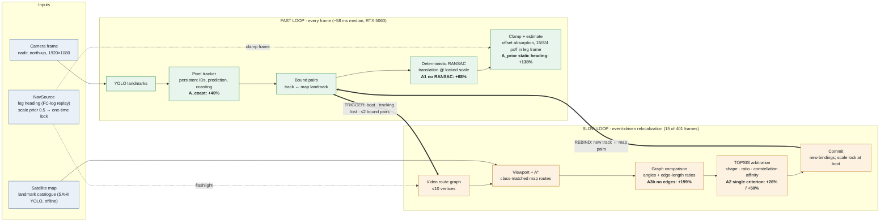

# Architecture: fast loop vs slow loop

The PNG is rendered by `scripts/render_architecture.py` using only matplotlib, with no external CLI. The Mermaid source below has the same structure and renders natively on GitHub.

Badges show the RMSE change when a component is removed. They were measured on GeoTest1 in Level 2 (see [level2_evaluation.md](level2_evaluation.md) and `out/ablations/summary.md`). Errors are measured against the **uncorrected** 4-waypoint GT polyline, and metres are map px × a nominal 0.5 m/px.

## Fast loop (continuation)

The fast loop runs on every frame and needs no graph search:

1. YOLO detects landmarks.
2. The pixel tracker keeps persistent IDs and predicts positions. A track missed by the detector *coasts* on its prediction and still votes.
3. Tracks bound to map landmarks at the last commit form bound pairs.
4. Deterministic exhaustive-consensus RANSAC solves a translation at the locked scale.
5. Offset absorption and an asymmetric kinematic clamp, expressed in the NavSource leg frame, produce the published estimate.

On GeoTest1, 386 of 401 frames are fast-loop only.

## Slow loop (relocalization)

The slow loop runs only when a trigger fires: at boot, when tracking is lost, or when bound pairs fall to two or fewer (a pre-emptive handoff). It works in five steps:

1. Build a route graph from the video landmarks.
2. Enumerate class-matched map routes with A* inside the predicted camera viewport. The NavSource heading steers a "flashlight" cone.
3. Compare the video and map graphs by internal angles and **edge-length ratios**, which are scale-invariant.
4. Rank the candidates with TOPSIS.
5. Commit new track ↔ map bindings. The scale is locked once, at boot.

Candidate generation takes ~355 ms median when it runs. All 15 slow-loop events on GeoTest1 were pre-emptive handoffs.

## Known limits (Level 2 evidence)

- **The trigger counts bound pairs, not their quality.** 3 pairs with 1 inlier, or 8 stale pairs, never fire a search.
- **The 8 px/frame lateral clamp paces both drift and recovery.** The heading prior comes from the waypoint legs and disagrees with image motion at the turn: a +23° jump against a +7.5° imaged turn.
- **Translation-only solver.** The camera must stay north-up nadir.
- **Weak ground truth.** GT is an uncorrected 4-waypoint polyline, and ATE measures cross-track error only. LSR stays 100% even at 70% dropout, so it is not a correctness metric.
- **Single sequence.** All numbers come from GeoTest1, a Google Earth render.
