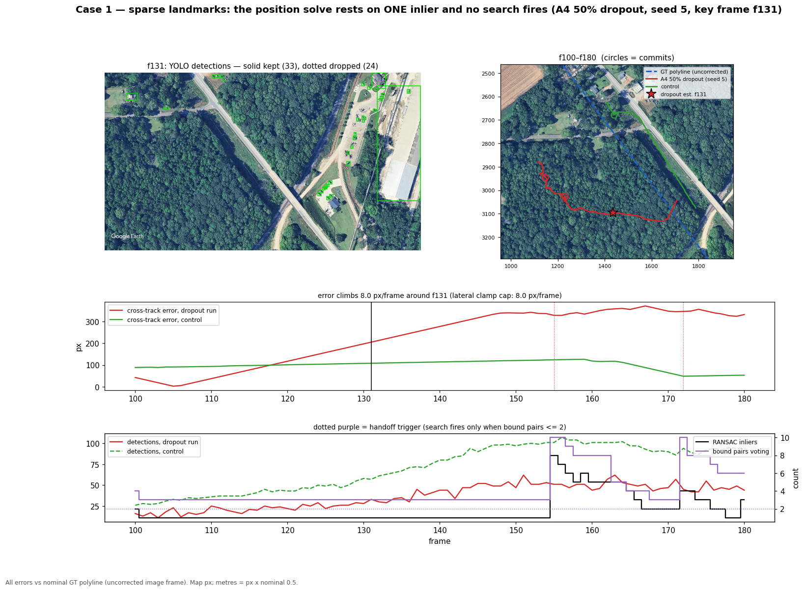
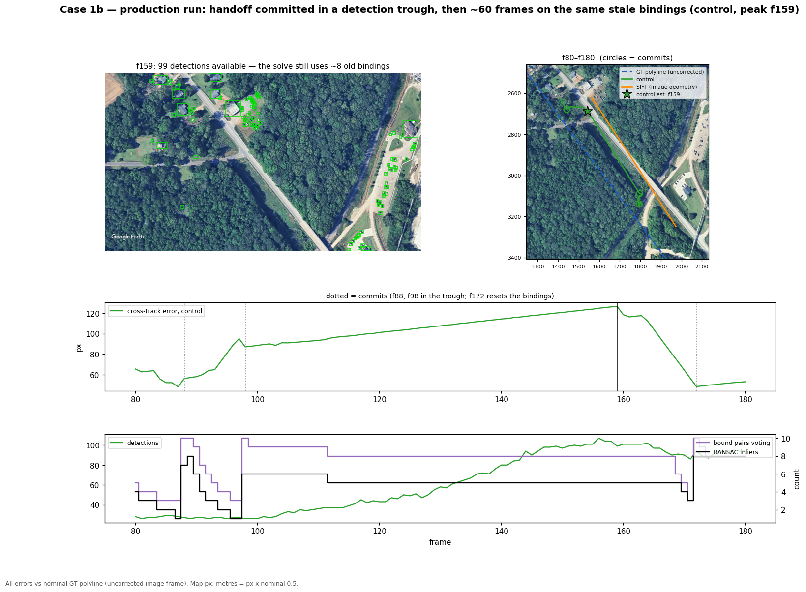
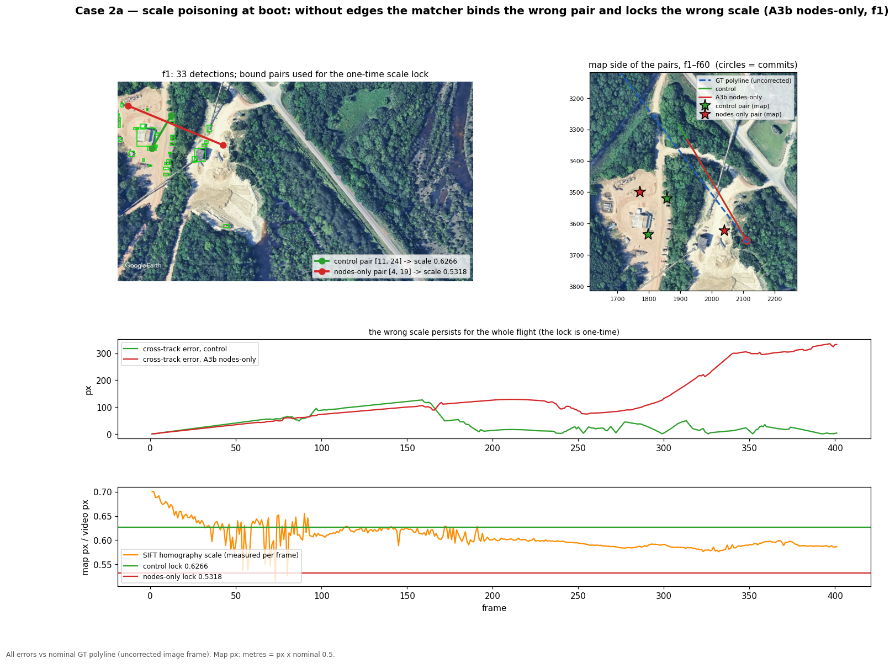
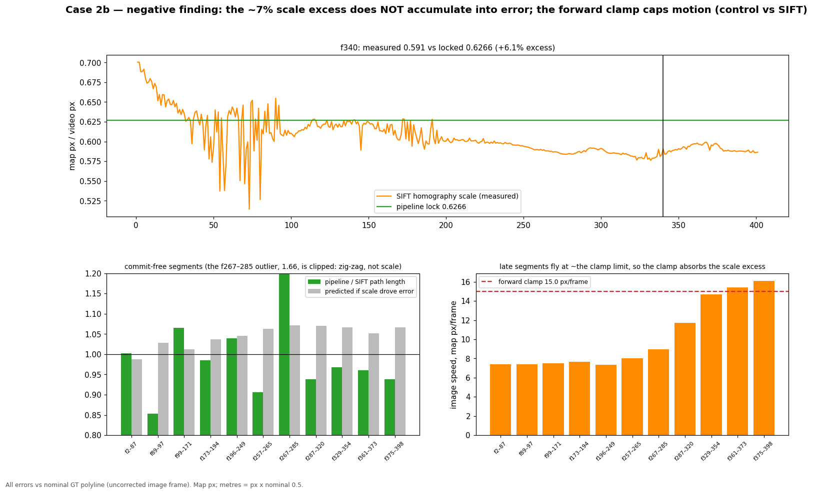
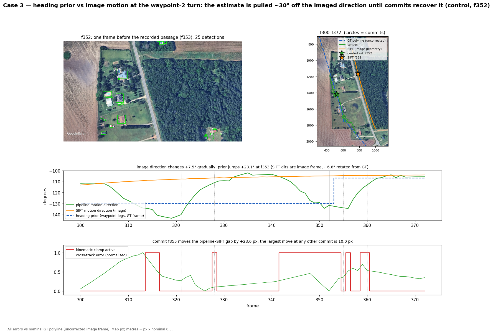

# Level 2.4 failure cases

All errors vs nominal GT polyline (uncorrected image frame). Generated by `scripts/render_failure_cases.py`; numbers in each `.json`.

## Sparse landmarks (A4 50% dropout, seed 5)

Data: [`case1_sparse_f131.json`](case1_sparse_f131.json)

## Stale bindings after a trough handoff (production run)

Data: [`case1b_stale_binding_f159.json`](case1b_stale_binding_f159.json)

## Boot scale poisoning without edges (A3b)

Data: [`case2a_scale_poison_f1.json`](case2a_scale_poison_f1.json)

## Negative finding: scale excess does not accumulate

Data: [`case2b_scale_nonaccumulation.json`](case2b_scale_nonaccumulation.json)

## Heading prior vs image motion at the turn (production run)

Data: [`case3_heading_prior_f352.json`](case3_heading_prior_f352.json)

